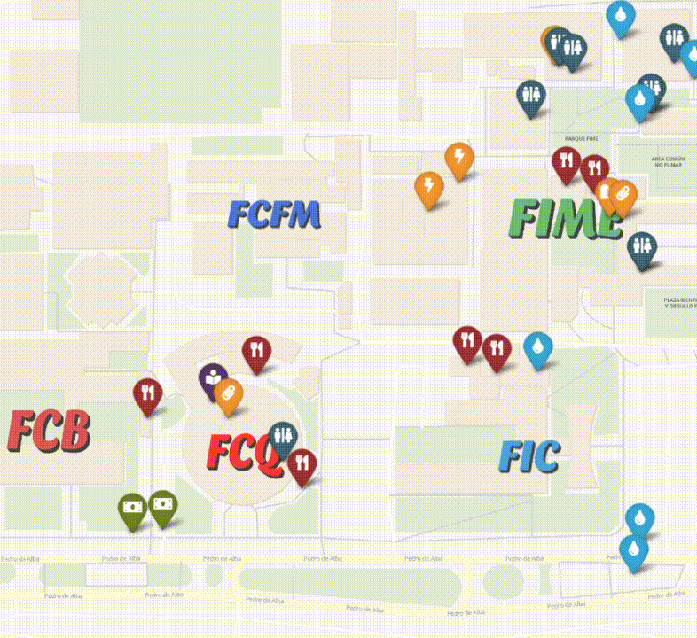

# UniMap

[LIVE website](https://og-brandon.github.io/unimap/)

UniMap is a responsive website made for [Proyecto Integrador II– Optativa VII FP ENE-JUN 2020](https://www.fime.uanl.mx/wp-content/uploads/2020/10/Proyecto-Integrador-II-.pdf). 

The goal was for students of the main campus of UANL in San Nicolas de los Garza to have a maps reference to reach a location like libraries, shops, and others.

The markers include the following:
- Places to eat across the campus.
- Stationery stores.
- Drinking fountains
- Public Restrooms
- Faculty Shops
- Libraries 
- ATM machines

The markers are provided by the 'data.json' file which is a JSON file that includes markers from its faculties as child objects. It includes:
- Name
- Description
- Category
- Coordenates
- Opening schedule
- Prices
- Tags
- Icons (From FontAwesome)

It's entirely client-side with Javascript with some [JQuery](https://github.com/jquery/jquery) and [Bootstrap](https://github.com/twbs/bootstrap) for styling. Libraries used throughout this project were:
- [LeafletJS](https://leafletjs.com/) for interacting with maps.
- [MapTiler Cloud - Voyager](https://leafletjs.com/) for the use of tiles. [A list of tiles can be obtained here.](https://leaflet-extras.github.io/leaflet-providers/preview/) 
- [Leaflet Routing Machine](https://github.com/perliedman/leaflet-routing-machine) - for adding routing through an API.
- [GraphHopper Directions API](https://www.graphhopper.com/) - API for the actual routing in the application. You will need to provide a new API key through their website, since the one in this project will expire and it's not secure.

Other/styling libraries include:
- [Leaftlet Awesome Markers](https://github.com/lennardv2/Leaflet.awesome-markers). 
- [Leaflet Easy Button](https://github.com/CliffCloud/Leaflet.EasyButton)
- [Leaflet Compass](https://github.com/stefanocudini/leaflet-compass)
- [Select2](https://github.com/select2/select2).
- [Egg.js](http://thatmikeflynn.com/egg.js/) It includes an easter egg :)

Design and documentation was done in collaboration with Arturo C. Treviño, Gerardo F. Lara y Samuel C. Pylant. If you want to check the paper (which includes the Design Thinking methodology), download it [here](https://github.com/og-brandon/unimap/raw/master/UniMap_Doc.pdf).
